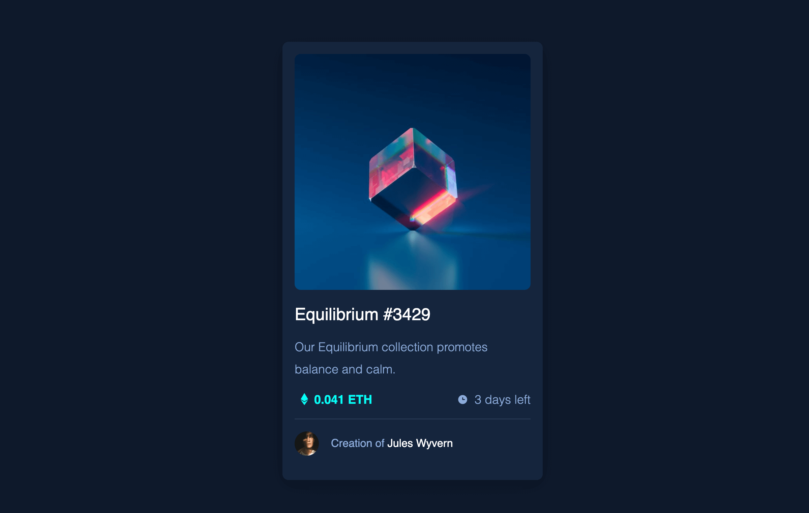

# Frontend Mentor - NFT preview card component solution

This is a solution to the [NFT preview card component challenge on Frontend Mentor](https://www.frontendmentor.io/challenges/nft-preview-card-component-SbdUL_w0U). Frontend Mentor challenges help you improve your coding skills by building realistic projects. 

## Table of contents

- [Overview](#overview)
  - [The challenge](#the-challenge)
  - [Screenshot](#screenshot)
  - [Links](#links)
- [My process](#my-process)
  - [Built with](#built-with)
  - [What I learned](#what-i-learned)
  - [Continued development](#continued-development)
  - [Useful resources](#useful-resources)
- [Author](#author)
- [Acknowledgments](#acknowledgments)


## Overview
Here's a brief overview of the project

### The challenge

Users should be able to:

- View the optimal layout depending on their device's screen size
- See hover states for interactive elements

### Screenshot



### Links

- Solution URL: [Git repo](https://github.com/nixoncode/nft-preview-card-component-main)
- Live Site URL: [Github pages](https://nixoncode.github.io/nft-preview-card-component-main/)

## My process
1. Started off writing HTML 
2. Add CSS starting from base styles
3. Added most css to achieve layout structure
4. Add minimal tweaks

### Built with

- Semantic HTML5 markup
- Vanilla CSS
- CSS variables
- Flexbox
- No javascript


### What I learned

I can center a `div` with CSS - yay!

To see how you can add code snippets, see below:

```html
<body>
  <section class="preview">
    ...
  </section>
</body>
```

```css
section.preview {
    flex: 1;
    align-self: center;
    display: flex;
    justify-content: center;
    align-items: center;
}
```

### Continued development
- **Responsive layout** – This challenge specified break points but I did not find anywhere to use it
- **Better naming** – Css class names could definitely improve
- **CSS reusability** - I tried to re-use most of CSS but still had a challenge, it could be more leaner

- **Cascading styles** – Say for example I have the following

> start of file
```css
a {
  text-decoration: none;
  color: pink;
}

a:hover {
  color: deeppink;
}
```
> somewhere along the way
```css
.footer a {
  color: fuchsia;
}
```
I expected the hover styles to still work, even for the footer links but it stopped.

Still need to figure that out


### Useful resources

- [CSS Scan](https://getcssscan.com/css-box-shadow-examples) - This helped me to copy and paste box shadows for cards.

## Author

- Website - [nixon kosgei](http://nixoncode.github.io/)
- Frontend Mentor - [@nixoncode](https://www.frontendmentor.io/profile/nixoncode)
- Twitter - [@nixoncode](https://www.twitter.com/nixoncode)


## Acknowledgments

To all the creators who put out content for free. Thank you

